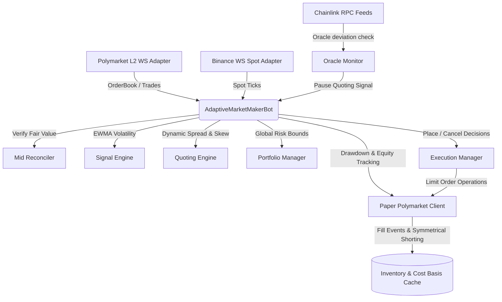

# 🤖 Adaptive Market Maker for Polymarket

A production-grade, high-frequency Quantitative Market Making Bot designed specifically for prediction markets on Polymarket. The bot combines real-time volatility-driven pricing, symmetrical inventory skewing, robust multi-layer risk controls, and a high-fidelity paper trading simulation engine to capture bid-ask spreads while minimizing toxic flow and inventory risk.

---

## 🏛️ System Architecture

The trading bot is built as an asynchronous, event-driven pipeline written in Python. It handles high-throughput market data from multiple feeds concurrently:



### 📁 Repository Structure & Module Map

Below is a detailed layout of the codebase highlighting the responsibilities of each module:

```
adaptive_market_maker/
├── adapters/                  # Connectivity & external API handlers
│   ├── base.py                # Generic models (OrderBook, TradeEvent, MarketSnapshot)
│   ├── binance_ws.py          # WebSocket client for real-time Binance spot pricing
│   ├── mid_reconciler.py      # Black-Scholes binary option validator comparing spot and PM mid
│   ├── polymarket_rest.py     # Polymarket CLOB REST client wrapping API requests
│   └── polymarket_ws.py       # Polymarket L2 orderbook and trade stream WS consumer
├── cli/                       # Entrypoints for launching the bot
│   ├── live.py                # Command-line interface for production execution (stub client)
│   └── papertrade.py          # Command-line interface for the high-fidelity simulator
├── config/                    # Global strategy & system settings
│   └── settings.py            # Pydantic configuration schemas with strict validation constraints
├── core/                      # Strategy orchestration and state tracking
│   ├── bot.py                 # Core bot loop routing events, checking risk, and executing actions
│   ├── interfaces.py          # Standard interfaces for exchange clients and data objects
│   ├── lifecycle.py           # Handles dynamic token discovery, roll-overs, and settlements
│   ├── paper_client.py        # High-fidelity simulator modeling latencies, fills, and cost bases
│   └── portfolio.py           # Manages active inventory sizing and global capital deployment limits
├── dashboard/                 # Console UI
│   └── terminal.py            # Rich console dashboard displaying real-time metrics, risk, and telemetry
├── engine/                    # Strategy decision modules
│   ├── execution_manager.py   # Translates quotes into place/cancel operations (dwell times & cooldowns)
│   ├── quoting_engine.py      # Calculates dynamic bid/ask spreads, skews, and emergency halts
│   └── signal_engine.py       # Tracks EWMA price log variance to estimate tick-level volatility
├── logs/                      # Directory for JSON logs and forensics
├── tests/                     # Comprehensive Pytest test suite
│   ├── test_adapters.py       # Adapter connection and message parsing tests
│   ├── test_audit_fixes.py    # Regression tests validating crucial audit fixes
│   ├── test_bot_e2e.py        # E2E strategy simulation tests
│   └── ...                    # Individual component unit tests
├── pyproject.toml             # Python build and test configurations
└── requirements.txt           # Required runtime and testing libraries
```

---

## 📈 Quantitative Strategy & Mathematical Model

### 1. Volatility-Driven Dynamic Quoting
Quoting static spreads in prediction markets exposes the market maker to adverse selection during price jumps. To prevent this, the bot dynamically calculates its target half-spread ($S_{\text{half}}$) based on the running volatility ($\sigma$) of the underlying asset (Binance spot mid) using a time-decaying Exponentially Weighted Moving Average (EWMA):

$$\sigma_t^2 = \lambda_{\text{eff}} \sigma_{t-1}^2 + (1 - \lambda_{\text{eff}}) r_t^2$$

Where the Effective Decay ($\lambda_{\text{eff}}$) is determined continuously based on the time elapsed between ticks ($\Delta t$) and the strategy's half-life time factor ($\tau$):

$$\lambda_{\text{eff}} = e^{-\frac{\Delta t}{\tau}}$$

This continuous formulation ensures that irregular spot update intervals do not bias volatility estimates. Log-returns are computed as $r_t = Spot_t - Spot_{t-1}$. The quoting half-spread is defined as:

$$S_{\text{half}} = \max\left( \frac{\text{MinSpread}}{2}, \text{VolMult} \times \sigma \right)$$

### 2. Symmetrical Inventory Skewing
To avoid accumulating massive, toxic inventory in a single direction, the quoting engine dynamically skews its bid and ask prices according to the current inventory ratio ($I_{\text{ratio}} = I_{\text{net}} / I_{\text{max}}$). The maximum inventory limit $I_{\text{max}}$ scales dynamically with price to reflect a fixed USDC position cap:

$$I_{\text{max}} = \frac{\text{MaxPositionUSDC}}{p_{\text{mid}}}$$

$$\text{Skew} = I_{\text{ratio}} \times \text{SkewFactor} \times S_{\text{half}}$$

The skewed bid and ask quotes are then shifted away from the fair mid-probability ($p_{\text{mid}}$):

$$p_{\text{bid}} = p_{\text{mid}} - S_{\text{half}} - \text{Skew}$$

$$p_{\text{ask}} = p_{\text{mid}} + S_{\text{half}} - \text{Skew}$$

> [!IMPORTANT]
> **Physical Effects of the Skew Direction:**
> * When **long inventory** ($I > 0 \implies \text{Skew} > 0$), Bids and Asks shift **downward** (decrease).
>   * The bid price is lowered relative to the mid ($p_{\text{mid}} - S_{\text{half}} - \text{Skew}$), making us less competitive to buy more YES shares.
>   * The ask price is lowered relative to the mid ($p_{\text{mid}} + S_{\text{half}} - \text{Skew}$), making us highly competitive to sell YES shares and reduce inventory.
> * When **short inventory** ($I < 0 \implies \text{Skew} < 0$), Bids and Asks shift **upward** (increase).
>   * The bid price is raised relative to the mid ($p_{\text{mid}} - S_{\text{half}} - \text{Skew}$), making us highly competitive to buy YES shares and cover the short.
>   * The ask price is raised relative to the mid ($p_{\text{mid}} + S_{\text{half}} - \text{Skew}$), making us less competitive to sell YES shares and expand the short.

### 3. Two-Tier Position & Inventory Protection
Beyond smooth skewing, the `QuotingEngine` implements two robust safety tiers to protect capital under severe inventory pressure:
1. **Tier 1: Soft-Disable (Widen Quoting)**: If the absolute net inventory reaches $1.0\times I_{\text{max}}$, the offending side is widened by doubling the half-spread (i.e. bid is lowered by an extra $2 \times S_{\text{half}}$ for long positions; ask is raised by $2 \times S_{\text{half}}$ for short positions). This makes executing a trade that increases our exposure extremely expensive for other participants.
2. **Tier 2: Hard-Halt (Emergency Stop)**: If inventory breaches $I_{\text{max}} \times \text{EmergencyFactor}$ (default $1.3\times$), quoting for the accumulating side is completely disabled (`None` quote is generated, prompting immediate order cancellation), ensuring no further toxic risk is accepted.

### 4. Option-Implied Mid Reconciler
The prediction market price of a binary contract (e.g., *"Will BTC be above \$95,000 at 16:00?"*) is mathematically tied to the underlying spot price through binary option pricing theory. The `MidReconciler` performs real-time fair-value verification using a Black-Scholes digital call formulation:

$$d = \frac{\ln(S / K)}{\sigma_{\text{annual}} \sqrt{t}}$$

$$\text{Theoretical Prob} = N(d)$$

Where:
* $S$: Current Binance spot price.
* $K$: Contract strike price parsed dynamically from the Polymarket question text.
* $\sigma_{\text{annual}}$: Tick-level EWMA volatility annualized using the factor $\sigma_{\text{annual}} = \sigma \sqrt{31,557,600}$.
* $t$: Remaining time to contract expiry in years.
* $N(d)$: Cumulative normal distribution function.

The reconciler executes a two-layer validation sweep:
* **Layer 1: Directional Sanity**: If the spot price is above the strike ($S > K$) but the Polymarket mid price is bearish ($p_{\text{mid}} < 0.40$), or if the spot price is below the strike ($S < K$) but the mid price is bullish ($p_{\text{mid}} > 0.60$), a gross directional misalignment is flagged.
* **Layer 2: Probability Divergence**: If the absolute difference between the Polymarket mid and the Black-Scholes probability exceeds the `divergence_threshold` (default $0.06$ or $6$ percentage points), a pricing anomaly is flagged.

> [!CAUTION]
> If either layer fails, the reconciler triggers an emergency halt. All live orders on that market are immediately cancelled to protect the bot from quoting during oracle pricing feed anomalies or extreme market dislocations.

---

## 🎯 High-Fidelity Paper Trading Simulation

To ensure strategy verification aligns perfectly with live CLOB (Central Limit Order Book) environments, the `PaperPolymarketClient` implements state-of-the-art market microstructure heuristics:

| Simulation Feature | Description | Mathematical / Technical Model |
| :--- | :--- | :--- |
| **Lognormal Latency** | Models realistic network round-trips. Lognormal profiles ensure strictly positive latencies with a heavy right-tail of connection anomalies. | $X \sim \text{Lognormal}(\mu, \sigma)$ derived from configurables. Supports rare fat-tail outliers ($P_{\text{fat}} = 1\%$ at $5\times$ latency multiplier). |
| **Adverse Selection** | Limit orders are systematically filled at worse prices right before adverse price jumps to mimic real CLOB toxicity. | Applies a configurable BPS penalty ($10\text{ BPS}$ base) to the fill price. Double penalty ($20\text{ BPS}$) applies if trade price crosses through order price. |
| **L2 Queue-Ahead & Clamping** | Mimics exact matching engine queue dynamics based on resting L2 volume at the order price. | Order rests behind volume. Clamped dynamically via L2 orderbook updates to avoid "ghost queue" under-fill bias when other participants cancel resting orders. |
| **Symmetrical YES/NO Shorting** | Polymarket CLOB has no native short-selling (shares cannot be borrowed). Going short YES requires buying NO tokens. | If an `ASK` YES order size exceeds YES holdings, the excess size is automatically routed as a `BID` on the `NO` token at price $1.0 - p_{\text{order}}$, matching real CLOB mechanics. |
| **Reconnect Cost-Basis Sync** | Preverves average entry price metrics across stream disconnects. | Synced inventory scales existing cost basis linearly using the prior average price instead of wiping it, avoiding false-positive drawdown flags. |
| **Drawdown Kill-Switch** | Continuous equity monitoring to shut down trading in case of severe capital depletion. | Equity = Initial Capital + Realized P&L + Unrealized P&L. If drawdown relative to peak equity exceeds `max_drawdown_pct` (e.g. $15\%$), a global halt is triggered. |

---

## ⚙️ Configuration Parameters Matrix

The bot settings are managed via strict Pydantic configurations in `config/settings.py` and are fully validated on startup:

| Parameter Key | Type | Default Value | Validation Constraint | Description & Operational Impact |
| :--- | :--- | :--- | :--- | :--- |
| **`paper_trading`** | `bool` | `False` | - | If `True`, enables the high-fidelity simulator, latency model, and forensic log file. |
| **`total_capital`** | `float` | `30.0` | - | Total capital available for deployment in USDC. |
| **`order_size_usdc`** | `float` | `1.0` | `> 0.0` | USDC value per limit order. Suppressed if sizing maps to below exchange minimums. |
| **`max_position_usdc`** | `float` | `50.0` | - | Max absolute value in USDC per market. Used to compute $I_{\text{max}}$. |
| **`max_capital_deployed_pct`** | `float` | `0.60` | `(0.0, 1.0]` | Hard cap on total capital locked in open orders + active inventory. |
| **`max_drawdown_pct`** | `float` | `0.15` | `[0.01, 1.0]` | Maximum drawdown percentage before triggering the emergency kill-switch. |
| **`spread`** | `float` | `0.008` | `>= 0.0` | Base target spread (80 BPS) used to capture profits in normal volatility. |
| **`min_spread`** | `float` | `0.006` | `>= 0.0` | Minimum allowed quoting spread to avoid unprofitable trades. |
| **`vol_mult`** | `float` | `2.0` | - | Volatility scaling multiplier. Half-spread adjusts as $\max(\text{Spread}/2, \text{vol} \times \text{VolMult})$. |
| **`vol_lambda`** | `float` | `0.94` | `< 1.0` | EWMA smoothing decay factor. Translated to continuous time-constant $\tau$. |
| **`skew_factor`** | `float` | `0.5` | - | Inventory skew multiplier. Higher values shift quoting prices more aggressively. |
| **`emergency_factor`** | `float` | `1.3` | - | Multiplier applied to $I_{\text{max}}$ to trigger Tier 2 hard emergency halts. |
| **`dwell_min_seconds`** | `float` | `3.6` | `>= 3.5` | Minimum order life in seconds before cancellations to qualify for exchange rebates. |
| **`requote_threshold`** | `float` | `0.003` | `>= 0.0` | Minimum price shift (0.3c) required to trigger a cancel-replace action. |
| **`cancel_cooldown_seconds`** | `float` | `0.5` | - | Cooldown between cancel requests per side to avoid API rate limit violations. |
| **`requote_cooldown_seconds`** | `float` | `1.0` | - | Cooldown between full requote (cancel + place) cycles per side. |
| **`oracle_pause_seconds`** | `float` | `15.0` | - | Look-ahead buffer to pause quoting before an oracle heartbeat update. |
| **`oracle_pause_cooldown_seconds`** | `float` | `30.0` | - | Seconds to maintain an oracle pause once conditions resolve (prevents thrashing). |
| **`expiry_pause_seconds`** | `float` | `90.0` | - | Time-window to stop quoting and cancel orders before market resolution expiry. |
| **`warm_up_seconds`** | `int` | `300` | - | Warm-up window required for EWMA spot prices before quoting. |
| **`warm_up_min_observations`**| `int` | `60` | - | Minimum spot ticks required during warm-up. |
| **`max_open_orders`** | `int` | `4` | `> 0` | Hard cap on total live orders across all markets to avoid over-exposure. |
| **`min_order_size`** | `float` | `0.0` | `>= 0.0` | Minimum size in shares. Orders below this are automatically suppressed. |
| **`markets`** | `list[str]` | `["ETH-15m", ...]` | Strict format | Target list of `ASSET-WINDOW` string pairs for discovery. |
| **`polygon_rpc_url`** | `str` | `"https://..."`| Valid URL | RPC endpoint used to poll Chainlink price feed smart contracts. |

---

## 🚀 Operational Playbook

### 1. Installation & Environment Set Up
Create a virtual environment and install the required dependencies:
```powershell
python -m venv venv
.\venv\Scripts\activate
pip install -r requirements.txt
```

### 2. Launching the Simulation (Paper Trading)
Run the high-fidelity simulator with real-time CLI dashboard updates:
```powershell
# Run with starting capital of $1000 and custom drawdown kill-switch at 15%
python -m cli.papertrade --capital 1000.0
```

### 3. Transitioning to Live Production Trading
Production execution utilizes Polymarket's Central Limit Order Book (CLOB) API. 
1. Bind your API credentials in your environment or Pydantic configs:
   * `POLYMARKET_API_KEY`, `POLYMARKET_SECRET`, `POLYMARKET_PASSPHRASE`, and `POLYMARKET_WALLET`.
2. Launch the live bot entrypoint:
   ```powershell
   python -m cli.live --capital 250.0 --markets BTC-15m ETH-15m
   ```

---

## 🖥️ Live Console Dashboard Guide

When the bot runs, it renders a terminal console UI split into several panels:

* **Header Panel**: Displays total capital, running uptime, active market warmup timers, and trading mode (e.g. `PAPER TRADING` or `LIVE TRADING`).
* **Active Markets Panel**: Real-time matrix of running markets showing:
  * *Spot*: Real-time Binance underlying spot price.
  * *PM Mid*: Polymarket current binary option mid probability.
  * *Spread / Vol*: Dynamic spreads and EWMA calculated volatility.
  * *Skew*: Calculated pricing offset shifts.
  * *Inv / Orders*: Current share inventory and active limit orders with dwell age and queue ahead positions.
* **Open Positions Panel**: Lists active risk exposures, side (LONG/SHORT), notional value, realized P&L, and unrealized P&L.
* **Trading Stats Panel**: Displays cumulative telemetry including total orders placed, execution fill counts, fills per minute, win rate, and Peak Drawdown percentages.
* **System Health Panel**: Monitors connection states for Polymarket WebSocket, Binance WebSocket, active Chainlink oracle pauses, and Drawdown Kill-Switch status.

---

## 📊 Forensic Log Auditing

All granular events, placement decisions, and fill logs are written in structured JSON format to `logs/paper_forensics.jsonl` for post-trade analysis.

### Standard JSON Events

#### 1. `order_placed`
Triggered whenever a limit order is sent to the client:
```json
{
  "timestamp": 1778715005.124,
  "event": "order_placed",
  "order_id": "paper_105",
  "market_id": "0xyes_token_address",
  "side": "BID",
  "price": 0.522,
  "size": 19.15,
  "queue_ahead": 450.0,
  "latency_ms": 32.14
}
```

#### 2. `order_filled`
Logs the details of a passive order fill, capturing realized P&L and matching spot levels:
```json
{
  "timestamp": 1778715012.845,
  "event": "order_filled",
  "order_id": "paper_105",
  "market_id": "0xyes_token_address",
  "side": "BID",
  "fill_price": 0.523,
  "fill_size": 10.0,
  "remaining_size": 9.15,
  "trade_timestamp": 1778715012.84,
  "inventory_after": 10.0,
  "cost_basis_after": 5.23,
  "realized_pnl": 0.0,
  "binance_spot_mid": 3122.50
}
```

#### 3. `market_settled`
Logs payout distributions at expiry ($1.00$ or $0.00$):
```json
{
  "timestamp": 1778715600.05,
  "event": "market_settled",
  "market_id": "0xyes_token_address",
  "payout": 1.0,
  "shares_yes": 15.0,
  "shares_no": 0.0,
  "pnl_realized": 7.15
}
```

#### 4. `drawdown_kill_switch`
Logs emergency halt alerts when the drawdown threshold is violated:
```json
{
  "timestamp": 1778715420.33,
  "event": "drawdown_kill_switch",
  "equity": 845.22,
  "peak": 1005.00,
  "drawdown_pct": 0.158
}
```

---

## 🛠️ Audit Hardening & System Stability

Following a rigorous trading systems audit, several high-frequency vulnerabilities were hardened to ensure bank-grade execution safety:

1. **Symmetrical YES/NO Shorting Fix**: Polymarket tracks inventories on separate token contracts. Standard short selling is simulated by routing ASK YES overflows to BID NO complementary contracts at $1.0 - p$. The client handles this seamlessly, preventing silent share leakages.
2. **Reconnect Cost-Basis Sync**: Restoring state after stream disconnects previously wiped cost bases, causing massive false-positive drawdown calculations. The reconnect handler now scales cost bases linearly using the prior average price.
3. **L2 Depth Cancellation Clamping**: In live markets, resting L2 depth shrinks rapidly when other market makers cancel. The queue-ahead tracker clamps `order.queue_ahead` dynamically to resting L2 depth on every L2 orderbook update, resolving the "ghost queue" simulation bias.
4. **Concurrent Initialization Guard**: Rapidly arriving WebSocket tick updates during market setup could spawn duplicate API queries. An async re-entry guard block locks context setup per market, preventing race conditions.
5. **UI Update Isolation**: Dashboard render calculations are isolated from trading loops using try-except blocks, ensuring that terminal UI crashes do not interrupt quoting tasks.
6. **Task Done-Callbacks**: Background tasks are registered with standard exception handlers (`add_done_callback`) and monitored within the main loop to ensure thread termination issues are surfaced immediately.

---

## 🧪 Testing & Verification Rigor

We maintain a rigorous regression and integration suite of **52 unit tests** achieving 100% success rates. The tests validate volatility calculations, reconciliations, queue models, and order execution constraints.

### Running the Tests
Execute the specific audit-hardening test cases:
```powershell
.\venv\Scripts\pytest -v tests/test_audit_fixes.py
```

Run the complete test suite:
```powershell
.\venv\Scripts\pytest
```

### Verification Logs Example
```
============================= test session starts =============================
platform win32 -- Python 3.12.10, pytest-9.0.3, pluggy-1.6.0
rootdir: D:\poly_kevin\polybot\adaptive_market_maker
testpaths: tests
plugins: asyncio-1.3.0, cov-7.1.0
collected 52 items

tests\test_adapters.py ..........                                        [ 19%]
tests\test_audit_fixes.py ....                                           [ 26%]
tests\test_bot_e2e.py .........                                          [ 44%]
tests\test_config.py ...                                                 [ 50%]
tests\test_discovery.py ......                                           [ 61%]
tests\test_execution_manager.py ........                                 [ 76%]
tests\test_quoting_engine.py .......                                     [ 90%]
tests\test_signal_engine.py .....                                        [100%]

============================= 52 passed in 3.01s ==============================
```
