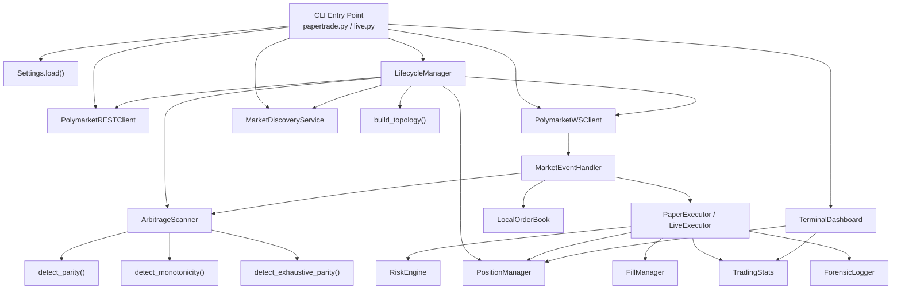

# Audit 02 — Scope of Review & Architecture (COMPLETED)

> [!NOTE]
> All architectural and scoping issues identified in this audit have been fully addressed and tested.

## Files Reviewed

Every source file in the repository was read and analyzed. The full inventory:

### Entry Points (CLI)
| File | Lines | Purpose |
|---|---|---|
| `bot/cli/papertrade.py` | 211 | Paper trading CLI — async orchestrator |
| `bot/cli/live.py` | 222 | Live trading CLI — real order execution |

### Dashboard
| File | Lines | Purpose |
|---|---|---|
| `bot/dashboard/terminal.py` | 400 | Rich terminal UI with real-time updates |
| `bot/dashboard/formatters.py` | 43 | Display formatting utilities |

### Strategy & Detection
| File | Lines | Purpose |
|---|---|---|
| `bot/arbitrage/scanner.py` | 197 | Orchestrates detectors against orderbook state |
| `bot/arbitrage/parity.py` | 82 | Type-A parity detector (subsumed by Type-C) |
| `bot/arbitrage/exhaustive_sets.py` | 119 | Type-C exhaustive BUY+SELL parity detector |
| `bot/arbitrage/monotonicity.py` | 87 | Type-B cross-timeframe monotonicity detector |
| `bot/arbitrage/opportunity.py` | 32 | ArbOpportunity / ArbLeg data models |

### Execution
| File | Lines | Purpose |
|---|---|---|
| `bot/execution/executor.py` | 23 | ExecutorProtocol interface |
| `bot/execution/live_engine.py` | 246 | Live order signing and placement |
| `bot/execution/events.py` | 204 | WebSocket message → scan → execute pipeline |
| `bot/execution/lifecycle.py` | 183 | Market discovery loop, settlement, WS management |
| `bot/execution/position_manager.py` | 285 | Position tracking, PnL, mark-to-market |
| `bot/execution/fill_manager.py` | 78 | Deduplication and inflight order tracking |

### Paper Trading
| File | Lines | Purpose |
|---|---|---|
| `bot/paper_trading/engine.py` | 221 | Simulated executor |
| `bot/paper_trading/stats.py` | 346 | Trading statistics accumulator |
| `bot/paper_trading/fills.py` | 50 | Depth-weighted VWAP fill simulation |
| `bot/paper_trading/slippage.py` | 29 | Slippage model |
| `bot/paper_trading/latency.py` | 30 | Latency injection |
| `bot/paper_trading/pnl.py` | 29 | PnL/Sharpe tracker (unused) |

### Risk
| File | Lines | Purpose |
|---|---|---|
| `bot/risk/engine.py` | 179 | Global risk limits, kill switch, stale-feed breaker |

### API Layer
| File | Lines | Purpose |
|---|---|---|
| `bot/api/polymarket.py` | 226 | REST client (Gamma + CLOB APIs) |
| `bot/api/websocket_client.py` | 110 | Reconnecting WebSocket client |
| `bot/api/schemas.py` | 49 | Pydantic data models |
| `bot/api/signer.py` | 74 | EIP-712 order signing |

### Market Discovery
| File | Lines | Purpose |
|---|---|---|
| `bot/market_discovery/discovery.py` | 71 | Market universe polling |
| `bot/market_discovery/market_relationships.py` | 80 | Topology builder (parity + monotonicity pairs) |
| `bot/market_discovery/parsers.py` | 53 | Slug parsing |

### Orderbook
| File | Lines | Purpose |
|---|---|---|
| `bot/orderbook/local_book.py` | 104 | L2 orderbook with snapshot + delta |
| `bot/orderbook/book_state.py` | 13 | Lifecycle state enum |
| `bot/orderbook/reconciliation.py` | 21 | Sequence gap detection (partially used) |

### Monitoring
| File | Lines | Purpose |
|---|---|---|
| `bot/monitoring/forensic.py` | 173 | Structured JSONL forensic logger |
| `bot/monitoring/health.py` | 93 | HTTP health/metrics endpoint |
| `bot/monitoring/logging.py` | 38 | Structlog configuration |

### Persistence
| File | Lines | Purpose |
|---|---|---|
| `bot/persistence/postgres.py` | 24 | SQLAlchemy async engine |
| `bot/persistence/models.py` | 38 | ORM models |
| `bot/persistence/repositories.py` | 24 | Trade repository |

### Utilities
| File | Lines | Purpose |
|---|---|---|
| `bot/utils/math.py` | 97 | Fee model, Kelly sizing |
| `bot/utils/clocks.py` | 59 | Pluggable clock system |
| `bot/utils/retries.py` | 52 | Async retry decorator |
| `bot/utils/ids.py` | 14 | Client order ID generation |
| `bot/utils/async_utils.py` | 19 | Concurrency-limited gather |

### Configuration
| File | Lines | Purpose |
|---|---|---|
| `bot/settings.py` | 128 | Pydantic-settings with TOML merge |
| `bot/constants.py` | 11 | Target assets and windows |
| `config/default.toml` | 29 | Default runtime configuration |

**Total:** ~3,800 lines of production code across 37 source files + 15 test files.

---

## Architecture Overview

---

## Data Flow — Paper Trading

1. **Startup:** `Settings.load()` → merge env + TOML config
2. **Discovery:** `MarketDiscoveryService.discover_markets()` → REST calls to Gamma API → filter by asset/window
3. **Topology:** `build_topology()` → build parity market list + monotonicity cross-join pairs
4. **Orderbook Init:** For each token: REST `get_orderbook()` → `LocalOrderBook.apply_snapshot()`
5. **Fee Rate Fetch:** For each token: REST `get_fee_rate()` → populate `fee_rates` dict
6. **WebSocket Connect:** Subscribe to all token_ids → `connect_and_run()`
7. **Main Loop:** `Rich.Live` at 2fps:
   - Compute mid prices from orderbooks
   - `position_manager.update_all_mtm(mid_prices)`
   - `dashboard.update(...)` — refresh terminal
   - `ws_client.check_stale()` — reconnect if silent
8. **WS Message → Event Handler:**
   - Parse `book` / `price_change` events → `LocalOrderBook.apply_snapshot/delta`
   - Warmup gate: suppress scanning until next 5-min boundary
   - Scan throttle: 200ms minimum between scans
   - `ArbitrageScanner.scan()` → produce `ArbOpportunity` list
   - For each opportunity: `executor.execute_opportunity(opp)`
9. **Paper Execution:**
   - Dedup check via `FillManager.check_and_mark()`
   - Atomic exposure reservation via `RiskEngine.reserve_exposure()`
   - Per-leg risk validation
   - Latency injection → VWAP fill simulation → fee calculation
   - `PositionManager.add_fill()` → `TradingStats.record_fill()`
10. **Background Tasks:**
    - `discovery_loop()` — poll for new markets every 60s
    - `order_ttl_loop()` — cancel expired orders every 5s
    - `HealthServer` — HTTP `/health` and `/metrics` endpoints
    - `_persistence_worker()` — async DB writes

## Data Flow — Live Trading

Identical to paper trading except:
- `LiveExecutor` replaces `PaperExecutor`
- Real account balance fetched via `get_balance_allowance()`
- Orders are EIP-712 signed via `sign_order()` and submitted to CLOB API
- Fill prices/sizes come from API response, not simulation
- No latency injection (real network latency)

---

## Paper/Live Parity Assessment

| Aspect | Paper | Live | Parity? |
|---|---|---|---|
| Risk engine | ✅ Full validation | ✅ Full validation | ✅ |
| Dedup | ✅ FillManager | ✅ FillManager | ✅ |
| Exposure reservation | ✅ Atomic | ✅ Atomic | ✅ |
| Matched sizing | ✅ Enforced | ✅ Enforced | ✅ |
| Kill switch on imbalance | ✅ Activated | ✅ Activated | ✅ |
| Fee calculation | ✅ polymarket_taker_fee | ✅ polymarket_taker_fee | ✅ |
| Stats recording | ✅ TradingStats | ✅ TradingStats | ✅ |
| Forensic logging | ✅ ForensicLogger | ✅ ForensicLogger | ✅ |
| Position tracking | ✅ PositionManager | ✅ PositionManager | ✅ |
| Fill source | Simulated VWAP | API response | ⚠️ Divergent by design |
| Order signing | N/A | EIP-712 signer | ⚠️ Live-only (buggy) |
| Inflight tracking | Not used | ✅ FillManager | ⚠️ Asymmetric |

> [!IMPORTANT]
> Paper and live executors have **good structural parity** — both follow the same risk → validate → execute → record flow. The primary divergence risk is in the signer and API response parsing, which are live-only code paths that cannot be validated by paper trading.
